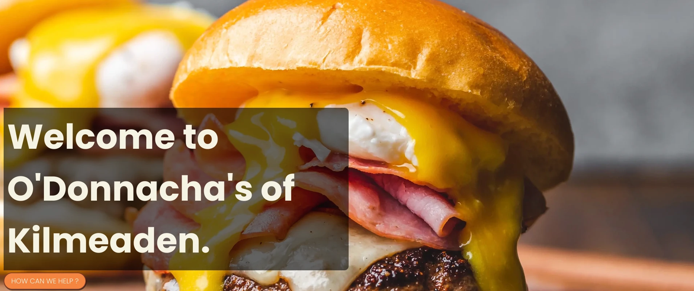

## O'Donnachas Gastropub

### Project Description

This site is aimed at giving you information about the gastropub O'Donnachas of Kilmeaden. Showcasing the food and drinks available, they great coutry pub atmosphere, friendly staff and warm welcome. It will dispaly location and contact information.

### Table of Contents

- [Roadmap](#roadmap)
- [UX](#ux)
  - [User Goal](#user-goal)
  - [User Story](#user-story)
  - [Owner Goals](#owner-goals)
- [Design](#design)
  - [Font](#font)
  - [Colors](#colors)
  - [Icons](#icons)
  - [Structure](#structure)
- [Wireframes](#wireframes)
- [Features](#features)
  - [Navigation](#navigation)
  - [Hero Section](#hero-section)
  - [About Us Section](#about-us-section)
  - [Services Section](#services-section)
  - [Contact Us Section](#contact-us-section)
  - [Location Section](#location-section)
  - [Footer](#footer)
- [Technologies](#technologies)
  - [Language](#language)
  - [Tools](#tools)
- [Validation](#validation)
- [Testing](#testing)
- [Bugs](#bugs)
- [Deployment](#deployment)
- [Contributions](#contributions)

<small><i><a href='http://ecotrust-canada.github.io/markdown-toc/'>Table of contents generated with markdown-toc</a></i></small>

## Roadmap

- Static website, menu, contact info, location, services
- Review section
- Social media integration
- Table reservation booking system

## UX

### User Goal

- Familiar design, mobile first
- Clear and quality images
- Easily navigatable
- Quality relevant content
- Location & contact info easily found
- Simple contact us form
- Links to all socials

### User Story

- As a user, I want to be able to navigate the website easily
- As a user, I want to be able to see what services you have available
- As a user, I want to be see images of the food you have
- As a user, I want to easily find you
- As a user, I want ways to contact you to be seen

### Owner Goals

- Increase ranking on search engines
- Easily contactable through multiple methods
- Convey the type of establisment and atmosphere

## Design

### Font

In order to get a nice feel and complementary fonts I used Poppins from [Google Fonts](https://fonts.google.com/) in order to select the best fonts I felt for the page. Using [Google Fonts](https://fonts.google.com/).

### Colors

Using the current color set of the bar, I chose a color pallete using [Coolors.co](https://coolors.co/)


- Primary color - #18280D
- Secondary color - #7c3626
- Accent primary color - #f5853f
- Secondary accent color - #f7f3e3

### Icons

Using [Font Awesome](https://fontawesome.com) I seleceted the social media icons and embedded them into the footer element

- 

### Structure

Based on current user experiences, I am choosing to go with a Mobile first approach. Using a single scrollable page with snap scrolling. I will modeling on iPhone 15 & Glaxay S20. I will be using breakpoints to make the page responsive for larger screens.

## Wireframes

Using Figma I have created initially the mobile first look and feel then scaled based on larger screen requirements


## Features

### Navigation

- Nav bar will remain fixed to the top and responsive to screen size. It will contain the menu items to move around the sections and the bar logo 

### Hero Section

- Hero will contact a large image with a text overly giving a short description of the gastropub 

### About Us Section

- Color block with text to explain a little about the place, history. 

### Services Section

- Services displayed on individual cards, allowing users to see quickly what is on offer 

### Contact Us Section

- Full contact information provided plus an email us form 

### Location Section

- Embedded good maps location plus address details 

### Footer

- Social media links and copywright information 

## Technologies

### Language

- HTML
- CSS

### Tools

- VSCode
- Github
- Figma
- HTML Validator
- CSS Validator
- Unsplash

### Frameworks & Libraries

- [Google Fonts](https://fonts.google.com/)
- [Font Awesome](https://fontawesome.com)

## Validation

- HTML validation showed 0 errors
- 
- CSS validation showed 0 errors
- 

## Testing

Testing was completed on multiple devices for resposiveness. All links and possible click throughs were also tested.

| Feature | Description | Steps | Outcome |
| --- | --- | --- | --- |
| Homepage Content | Displays relevant information on the homepage. | N/A | Homepage shows latest content and updates. |
| Contact Form | Includes a contact form for user inquiries. | 1. Fill out the contact form. | Submission successful, user gets a Thank You page and redirect. |
| Responsive Design | Ensures the website works well on all devices. | N/A | Website layout adjusts to different screen sizes. |
| Navigation Menu | Provides easy navigation through the site. | 1. Click on various menu items. | Smooth navigation, correct pages are loaded. |
| Social Media Integration | Connects the website with social media platforms. | 1. Share a page on social media. | Page is shared with the correct link and image. |

## Bugs

| Bug | Status | Description | Steps To Resolve |
| --- | --- | --- | --- |
| Form not sending correctly | ~~Resolved~~ | When submitting the contact us form no action was being performed | Added the GET method to the |
| Contact & Find Us not linking | ~~Resolved~~ | When clicking contact us or find us on menu, nothing happeing | Added the # reference to the link to resolve |
| Navigation overflowing on mobile | ~~Resolved~~ | When accessing the nav mar on mobile it was overflowing to the next container | Added a flex display and property value to resolve |
| Images not displayed | ~~Resolved~~ | When deployed images were not loading correctly | Removed the leading / to resolve |

## Deployment

Once code has been completed, it is pushed to Github for deployment using the pages feature. The site is now accessible via:

- [ODOK](https://whalloranirl.github.io/odok/index.html)

Steps needed to deploy

- Navigate to the repository on github and click **settings**.
- Then select **pages** on the side navigation.
- Select the none dropdown, and then click **main**.
- Click on the **save** button.
- If any changes are required, they can be done, commited and pushed to GitHub and the changes will be updated.

```
https://YOURGITHUBNAME.github.io/odok
```

## Thank You

- Simen Daehlin
- Mate Rizco
